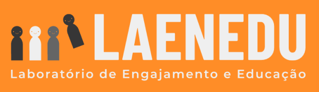
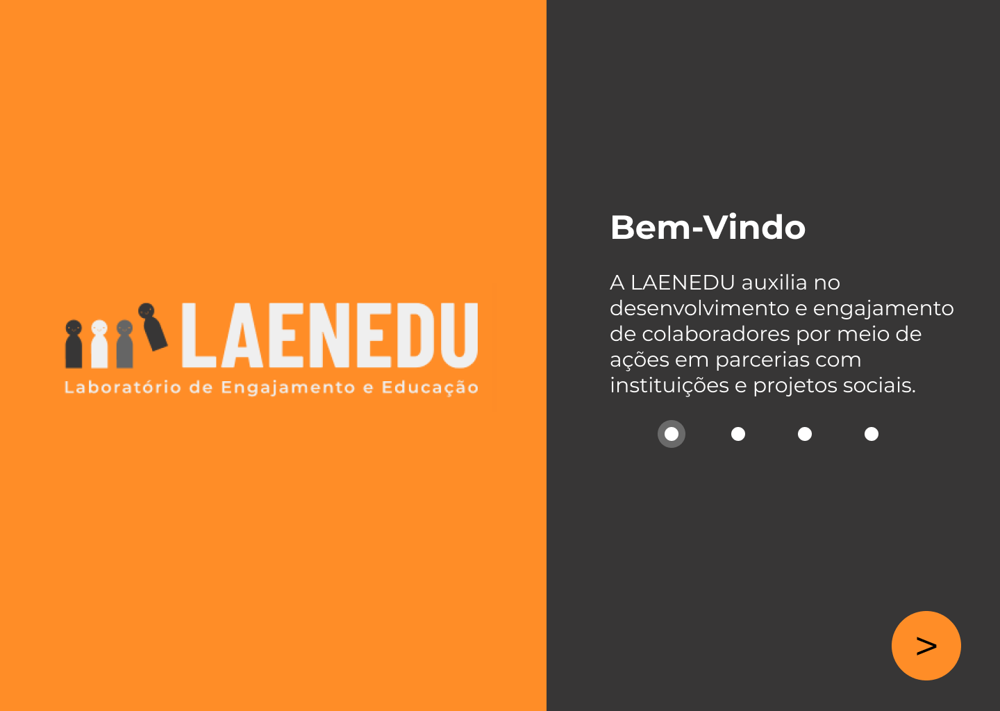
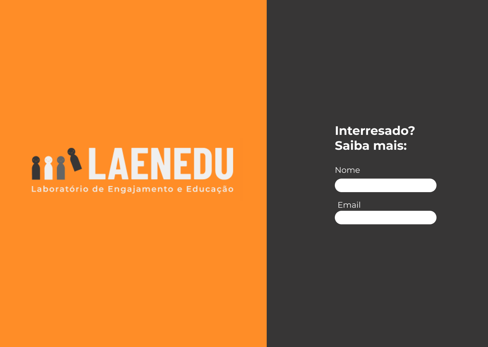

<h1 align="center">
  
</h1>

<p align="center">
  <a href="https://github.com/awlana04">
    
  </a>

  <a href="https://www.linkedin.com/in/thales-morais/">
    
  </a>

  <a href="https://linkedin.com/in/paulmspessoa">
    
  </a>

  <a href="https://www.linkedin.com/in/michele-da-cruz/">
    
  </a>

 <a href="https://www.linkedin.com/in/silvana-elert">
    
  </a>

 <a href="https://www.linkedin.com/in/carolinesdias/">
    
  </a>

  
</p>

<p align="center">
  <a href="#rocket-sobre">Sobre</a>&nbsp;&nbsp;&nbsp;|&nbsp;&nbsp;&nbsp;
  <a href="#rocket-sobre">Colaboradores</a>&nbsp;&nbsp;&nbsp;|&nbsp;&nbsp;&nbsp;
  <a href="#rocket-como-inicializar-o-projeto">Como baixar o projeto</a>&nbsp;&nbsp;&nbsp;|&nbsp;&nbsp;&nbsp;
  <a href="#rocket-tecnologias-utilizadas">Tecnologias utilizadas</a>&nbsp;&nbsp;&nbsp;|&nbsp;&nbsp;&nbsp;
  <a href="#pagefacingup-licença">Licença</a>
</p>

<h3>
  
</h3>

<h3>
  
</h3>

## Sobre

O **LAENEDU** é uma aplicação que foi desenvolvida no RHackathon, e tem como objetivo auxiliar no desenvolvimento e engajamento dos colaboradores, por isso, disponibilizamos acesso a **Bootcamps** para atividades sociais que ajudem no desenvolvimento de skills.

## Colaboradores

Nós somos o **time 8**, e nosso time é composto pelos integrantes:

- Thales Morais - Dev FullStack
- Awlana Costa - Dev FullStack
- Paulo Pessoa - Business
- Michele da Cruz - Especialista em Recursos Humanos
- Silvana Elert - Especialista em Recursos Humanos
- Caroline Dias - Especialista em Recursos Humanos

## Como inicializar o projeto

Para clonar e rodar a aplicação é preciso ter o [git](https://git-scm.com/), o [node.js](https://nodejs.org/en/) ou o [yarn](https://yarnpkg.com/).

```bash
  # Clonar o repositório
  $ git clone https://github.com/Thalesmoraisdealmeida21/laenedu.git
  # Entrar nas pastas necessárias
  $ cd sputrocket
  $ cd backend
  # Instalar as dependências necessárias
  $ yarn
  # Rodar o back-end da aplicação
  $ yarn dev
```

Em outro terminal, caso ainda esteja na pasta **backend** digite:

```bash
  # Para sair e depois entrar na pasta mobile
  $ cd
  $ cd web
  $ yarn
  # Inicializar a aplicação
  $ yarn start
```

**Caso você utilize o npm é só alterar o yarn por npm.**

## :rocket: Tecnologias utilizadas

O projeto foi desenvolvido nas seguites tecnologias:

- [ReactJS](https://pt-br.reactjs.org/)
- [TypeScript](https://www.typescriptlang.org/)
- [Express](https://expressjs.com/pt-br/)
- [TypeORM](https://typeorm.io/)
- [Yup](https://github.com/jquense/yup)
- [Axios](https://github.com/axios/axios)

## :page_facing_up: Licença

Esse projeto está sob a licença MIT. Veja o arquivo [LICENSE]() para mais detalhes.